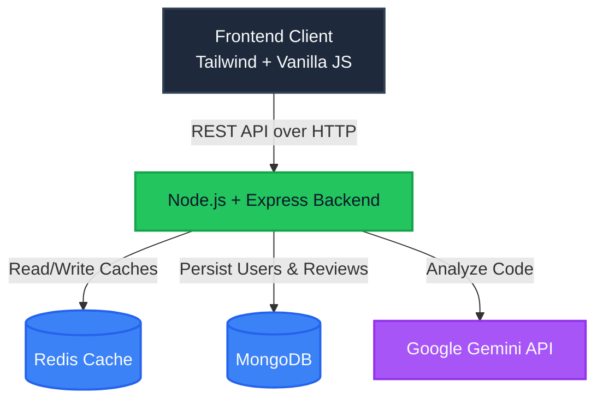
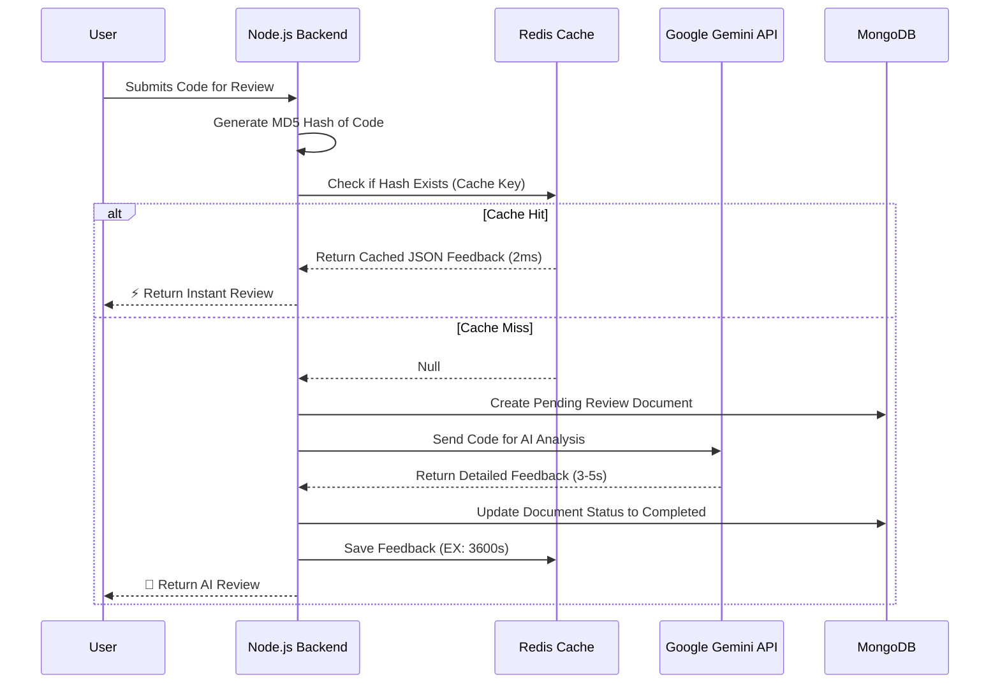

# CodeReview AI 🚀

A full-stack AI-powered code review platform that analyzes your code, finds bugs, and suggests improvements using Google's Gemini AI. Built with performance and efficiency in mind, utilizing Redis for high-speed caching.

---

## 🌟 Features

- **AI Code Analysis**: Deep code review using Google Gemini API to catch bugs, vulnerabilities, and bad practices.
- **Lightning Fast Caching**: Identical code submissions are served instantly from a Redis cache, saving API costs and reducing response times from seconds to milliseconds.
- **Secure Authentication**: User signup and signin using `bcrypt` password hashing and stateless `JWT` tokens.
- **API Rate Limiting**: Protects the backend from spam and abuse (max 10 reviews per hour per IP).
- **Beautiful UI/UX**: Dark-themed, responsive frontend built with Vanilla JS, Tailwind CSS, and Lucide icons. Includes skeleton loaders and cache-hit badges.

---

## 🛠️ Tech Stack

### Backend
- **Node.js & Express**: Fast, unopinionated web framework.
- **MongoDB & Mongoose**: NoSQL database for storing users and review histories.
- **Redis & ioredis**: In-memory data structure store used for caching Gemini API responses.
- **Google Generative AI**: The brain behind the code reviews (`@google/generative-ai`).
- **Security**: `jsonwebtoken`, `bcrypt`, `cors`, `express-rate-limit`.

### Frontend
- **HTML5 & Vanilla JavaScript**: No heavy frameworks, purely DOM manipulation.
- **Tailwind CSS**: Utility-first CSS framework (via CDN).
- **Fonts**: *JetBrains Mono* (for code blocks) and *IBM Plex Sans* (for UI).

### Architecture Flow



---

## ⚡ How The Redis Cache Works

One of the standout features of this project is the **Redis Caching Layer**. AI API calls are expensive and slow (taking 3-5 seconds). 



To optimize this, we implemented an `md5` hashing mechanism:

1. **Fingerprinting**: When a user submits code, we create an MD5 hash of the raw code string (e.g., `a1b2c3d4...`).
2. **Cache Lookup**: We check Redis for the key `newreview:{language}:{hash}`.
3. **Cache Hit (Instant)**: If the hash exists, we return the parsed JSON feedback directly from RAM in ~2ms. The UI displays a "⚡ Loaded from Cache" badge.
4. **Cache Miss (Slow)**: If the hash doesn't exist, we call the Gemini API, wait for the response, save it to MongoDB, and store the result in Redis with a **1-hour expiration (`EX 3600`)**.

This ensures that widely used snippets or repeated submissions don't waste API quota.

---

## 🚀 Getting Started

### Prerequisites
- [Node.js](https://nodejs.org/) (v20+)
- [MongoDB](https://www.mongodb.com/) (running locally or Atlas URI)
- [Redis](https://redis.io/) (running locally on default port 6379)

### Installation

1. **Clone the repository:**
   ```bash
   git clone <your-repo-url>
   cd mock
   ```

2. **Install dependencies:**
   ```bash
   npm install
   ```

3. **Start Redis server (macOS):**
   ```bash
   brew services start redis
   ```

4. **Start the development server:**
   ```bash
   npm run dev
   ```

5. **Open the App:**
   Visit `http://localhost:3000` in your browser.

---

## 🧪 Testing the API

A `test.rest` file is included in the root directory for use with the VS Code REST Client extension. It contains pre-configured requests for Signup, Signin, and Code Submission (including tests for cache hits and buggy code).

---

*Designed and built with precision.*
